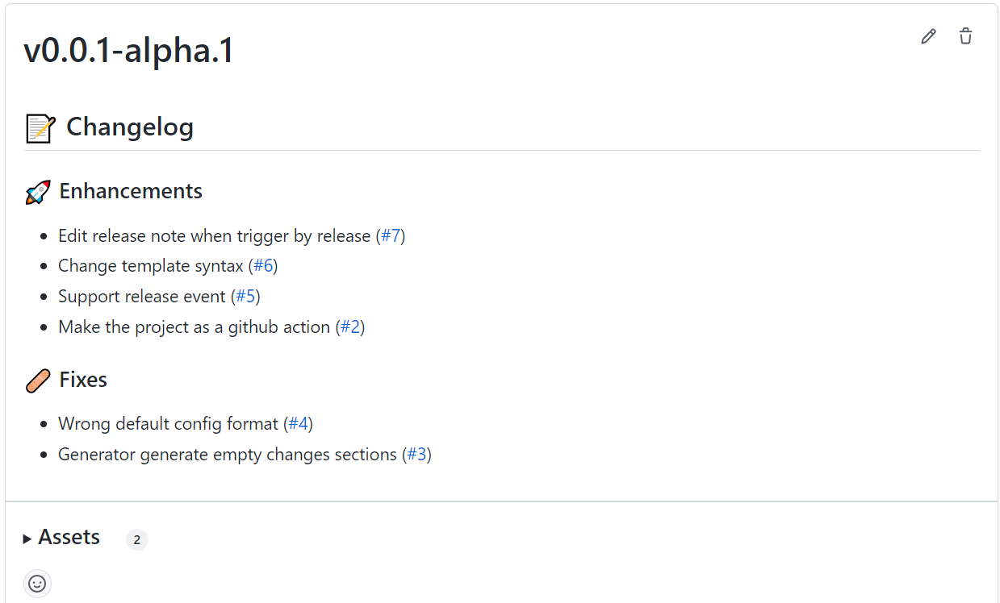

[
 ![Contributors][contributors-shield]][contributors-url]
[![Forks][forks-shield]][forks-url]
[![Stargazers][stars-shield]][stars-url]
[![MIT License][license-shield]][license-url]
[![Issues][issues-shield]][issues-url]
[![Issues Closed][issues-closed-shield]
][issues-closed-url]

 

GitHub Action to generate release notes from pull requests. Using Relno.

## Screenshots

## Documentation

Documentation is available at [Relno Docs](https://relno.ppodds.cc).

## License

Distributed under the MIT License. See
[LICENSE](https://github.com/ppodds/relno-action/blob/master/LICENSE)
for more information.

## Contributors

[contributors-shield]: https://img.shields.io/github/contributors/ppodds/relno-action.svg?style=for-the-badge
[contributors-url]: https://github.com/ppodds/relno-action/graphs/contributors
[forks-shield]: https://img.shields.io/github/forks/ppodds/relno-action.svg?style=for-the-badge
[forks-url]: https://github.com/ppodds/relno-action/network/members
[stars-shield]: https://img.shields.io/github/stars/ppodds/relno-action.svg?style=for-the-badge
[stars-url]: https://github.com/ppodds/relno-action/stargazers
[issues-shield]: https://img.shields.io/github/issues/ppodds/relno-action.svg?style=for-the-badge
[issues-url]: https://github.com/ppodds/relno-action/issues
[issues-closed-shield]: https://img.shields.io/github/issues-closed/ppodds/relno-action.svg?style=for-the-badge
[issues-closed-url]: https://github.com/ppodds/relno-action/issues?q=is%3Aissue+is%3Aclosed
[license-shield]: https://img.shields.io/github/license/ppodds/relno-action.svg?style=for-the-badge
[license-url]: https://github.com/ppodds/relno-action/blob/master/LICENSE
